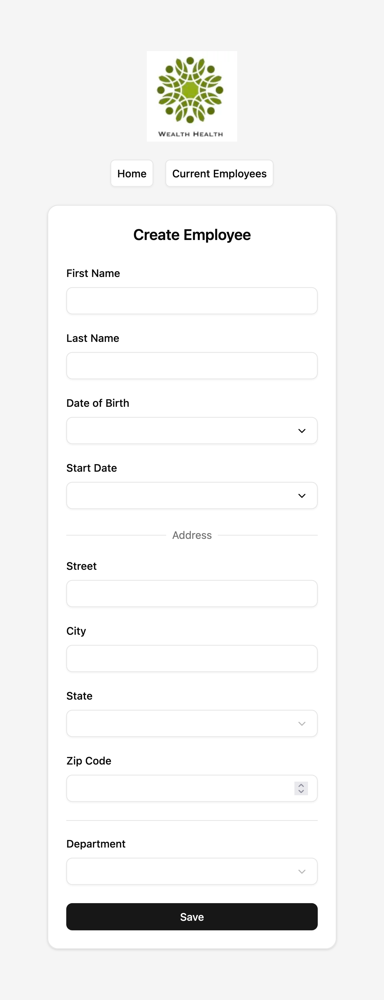
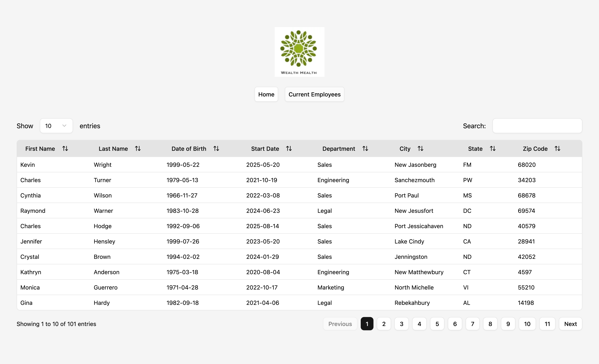
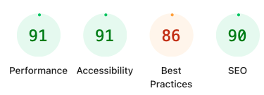
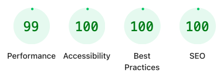

# OpenClassrooms – Project 14 HRnet

## 📌 Description

Source code of **Project 14 – HRnet**, completed as part of the **JavaScript React Application Developer path**.

The project consists of **migrating an existing jQuery-based HR management application to React** for **WealthHealth**, a large financial company.

The goal is to modernise the internal **HRnet** application by replacing legacy jQuery plugins with **React components**, improving performance, maintainability, and scalability.

This migration aims to:

* Replace outdated UI plugins with modular, reusable React components,
* Reduce technical debt,
* Improve performance (measured before and after migration using Lighthouse),
* Document the new React components for future maintenance and scalability.

The application is **initialised with mockup data** (101 employees) by default.
This behaviour can be configured in `src/config.ts` by switching the global variable `MOCKUP_DATA` from `true` to `false`.

> ⚠️ Setting MOCKUP_DATA to false allows testing the app with a real or external data source.
---

## 🎯 Learning Objectives

* Analyse and improve **web application performance**
* Refactor an existing app to **reduce technical debt**
* Deploy a **front-end application**
* Set up a **modern front-end environment**
* Produce **technical documentation** for a React component and project architecture

---

## 🏢 Project Context

You work as a front-end developer for **WealthHealth**, a major financial organisation.
The company’s HR management web application — **HRnet** — was built years ago using jQuery.
Over time, this legacy architecture has led to:

* Performance bottlenecks,
* Numerous internal complaints,
* Maintenance challenges due to outdated dependencies.

Your team has been authorised to start **migrating HRnet to React**.
Your mission focuses on converting **one of the main jQuery plugins** into a **React component**, refactoring the application pages accordingly, and measuring the resulting performance improvements.

---

## ⚙️ Technical Scope

The migration includes:

1. **Converting the entire HRnet application** from jQuery to React.

    * Pages: “Home” to Create Employee and “Employee List”.
    * Implementing **state management** with Redux Toolkit (instead of local storage).
    * Preserving or modernising the existing UI.

2. **Replacing jQuery plugins**:

    * Date picker,
    * Modal windows,
    * Dropdown menus,
    * Data tables.

   One plugin was fully rewritten and published as an **NPM package**:
   👉 [`tiny-react-dialog`](https://www.npmjs.com/package/tiny-react-dialog)

   The remaining components are based on the **shadcn/ui** library, providing a consistent and modern interface.

3. **Performance audits**:

    * Conducted with **Lighthouse** before and after the migration.
    * Metrics include load times, accessibility, and best practices.
    * Note: Performance measurements are **limited by GitHub free servers**, which can impact Lighthouse scores.

4. **Documentation & Reporting**:

    * Technical documentation describing architecture, design decisions, and component APIs.
    * Lighthouse audit reports are **automatically generated and deployed to GitHub Pages**.

---

## 🧩 Front-End Stack

| Category          | Technology                             |
|-------------------|----------------------------------------|
| Framework         | React (Vite + TypeScript)              |
| State Management  | Redux Toolkit                          |
| UI Components     | shadcn/ui + custom `tiny-react-dialog` |
| Styling           | Tailwind CSS                           |
| Forms             | React Hook Form + Zod validation       |
| Tables            | @tanstack/react-table                  |
| Testing           | Vitest + Testing Library               |
| Build Tool        | Vite                                   |
| Linting           | ESLint + Prettier                      |
| Performance Audit | Lighthouse + @lhci/cli                 |
| CI/CD             | GitHub Actions                         |

---

## 🧪 Testing & CI/CD Workflow

Unit tests are written with **Vitest** and **@testing-library/react**, ensuring component reliability and behaviour consistency.
All tests are executed automatically through the **GitHub Actions CI pipeline**.

The continuous deployment pipeline performs the following steps:

1. **Builds** the application with Vite and TypeScript.
2. **Runs unit tests** and **collects coverage reports** via Vitest.
3. **Performs a Lighthouse audit** using **`@lhci/cli`**.
4. **Deploys the Lighthouse report** to **GitHub Pages**.

You can view the results [here](https://sedomu.github.io/oc_p14_HRnet/).

> ⚠️ The application itself is **not deployed**. It is built as a **temporary artefact** for performance testing only.
> Only the **Lighthouse audit report** is published and accessible to users.
> ⚠️ Lighthouse results are **impacted by GitHub free server limitations**, which can reduce performance scores.

---

## 📦 NPM Package – `tiny-react-dialog`

[`tiny-react-dialog`](https://www.npmjs.com/package/tiny-react-dialog)
A **simple, lightweight, and customisable React library** for displaying modal dialog boxes.

It replaces the old **jQuery modal plugin** used in HRnet, providing a modern, accessible, and reusable solution.

### ✨ Features

* Lightweight and dependency-free
* Controlled component design (`visible` + `onClose`)
* Optional built-in styles
* Easily customisable via `classNames` prop (compatible with Tailwind CSS)
* Fully typed with TypeScript

### 🧩 Example Usage

```tsx
import { useState } from "react";
import { TinyReactDialog } from "tiny-react-dialog";
import "tiny-react-dialog/index.css";

export default function Example() {
  const [isVisible, setIsVisible] = useState(false);
  return (
    <>
      <button onClick={() => setIsVisible(true)}>Open Dialog</button>
      <TinyReactDialog visible={isVisible} onClose={() => setIsVisible(false)}>
        Dialog content goes here.
      </TinyReactDialog>
    </>
  );
}
```

### ⚙️ Props

| Prop         | Type         | Default  | Description                                              |
|--------------|--------------|----------|----------------------------------------------------------|
| `visible`    | boolean      | `false`  | Controls the dialog visibility                           |
| `onClose`    | `() => void` | Required | Callback triggered when user closes the dialog           |
| `children`   | ReactNode    | —        | Dialog content                                           |
| `classNames` | object       | `{}`     | Optional custom class names for overlay, container, etc. |

---

## 🏗 Project Architecture

### 1. Entry Point

* `src/main.tsx` – initializes React, Redux, and routing.
* `src/router.tsx` – defines navigation between pages.
* `src/redux.ts` – Redux Toolkit slices and store configuration.
* `src/components/` – reusable UI elements and custom hooks.
* `src/pages/` – home and employees list pages.
* `tests/` – Vitest unit tests and coverage setup.

### 2. Pages

* **Home**, to Create Employee – a form with validation, date picker, and modal confirmation.
* **Employee List** – dynamic table with sorting and filtering, powered by React Table.

---

## 📘 Available Scripts

| Command            | Description                              |
|--------------------|------------------------------------------|
| `npm run dev`      | Launches development server              |
| `npm run build`    | Builds the project for production        |
| `npm run preview`  | Serves the built version locally         |
| `npm run lint`     | Runs ESLint for code quality             |
| `npm run prettier` | Formats code with Prettier               |
| `npm run test`     | Runs unit tests with Vitest              |
| `npm run coverage` | Runs tests and generates coverage report |

---

## 🧭 Performance Analysis

Performance comparisons were conducted between:

* The legacy **jQuery HRnet** version,
* The new **React HRnet** version.

Key findings:

* **Reduced DOM manipulation overhead** thanks to React’s virtual DOM,
* **Faster load times** after build optimisation,
* **Improved accessibility and best-practice scores**,
* **Simplified maintenance** via modular React components.

All performance data are included in the **Lighthouse CI report**, automatically deployed on GitHub Pages.

> ⚠️ Lighthouse results are **impacted by GitHub free server limitations**, which can reduce performance scores.

You can view the results [here](./lighthouse-reports/), with a report for each page (Home and Employee List) and for each build (legacy and React).

---

## 🖼 Screenshots

| Description                       | Screenshot                                           |
|-----------------------------------|------------------------------------------------------|
| Home / Create Employee page       |                            |
| Employee List table               |          |
| Lighthouse audit – jQuery version |  |
| Lighthouse audit – React version  |    |

---

## 🛡️ Security Note

This project is a **pedagogical exercise** built for educational purposes under the OpenClassrooms curriculum.
It is **not intended for production use**.

---

## 🧠 Key Takeaways

This project demonstrates:

* A **real-world migration** from jQuery to modern React,
* The importance of **component modularisation** and functional programming,
* How to **measure and validate performance improvements** with Lighthouse,
* The process of **publishing reusable components** to NPM,
* And the setup of a complete **CI/CD workflow** integrating unit tests and automated reporting.